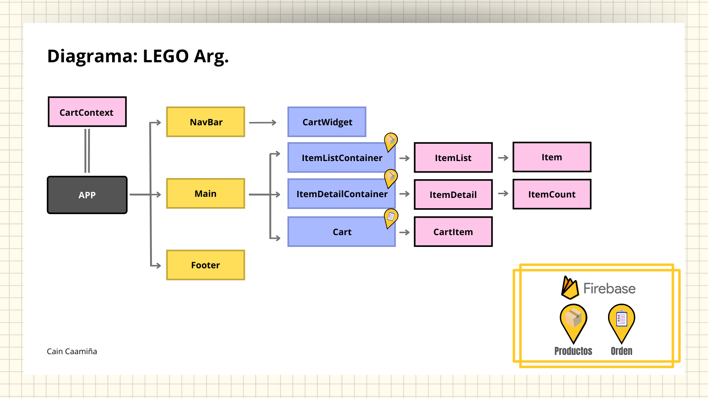

# Proyecto Final ReactJS - CoderHouse

## _LEGO Argentina_

Proyecto realizado dentro de la carrera "Frontend con React", como desafio final con ReactJS. En el mismo se plantea la idea de un comercio electronico, tambien conocido como "e-commerce", la misma se encuentra desarrollada totalmente con React, maquetada con React-Boostrap y Firebase como base de datos.

## Liberias y Frameworks utilizados

Utiliza esta serie de liberias y frameworks para que el proyecto funcione correctamente.

| Libreria/Framework | Version   |
| ------------------ | --------- |
| react-bootstrap    | v2.2.3 +  |
| bootstrap          | v5.1.3 +  |
| firebase           | v9.6.10 + |
| node-sass          | v7.0.1 +  |
| react-dom          | 17.0.2 +  |
| react-router-dom   | v6.2.2 +  |
| react-toastify     | v8.2.0 +  |
| validator          | v13.0.7 + |

## Modo de uso

1. Entra a la web y selecciona la categoria/serie que mas te agrade.
2. Selecciona el LEGO que deseas y da click en el boton "Detalles".
3. Mira el producto y sus caracteristicas, para luego seleccionar la cantidad que requieres y dar click en "Agregar al carrito".
4. Para ir al carrito debes dar click en el boton "Ir al carrito" y revisa los articulos seleccionados.
5. Complete la información requerida en el formulario ubicado en el lado derecho.
6. Finalize la compra haciendo click en el boton "Confirmar Compra".

## Diagrama del proyecto

A continuación se muestra un diagrama de flujo que muestra la estructura general del proyecto para una mejor comprensión.

## Demostracion de funcionamiento

A continuación se muestra un video del proceso completo de funcionamiento, el mismo sera realizado siguiendo el "Modo de uso".

## Galeria de Imagenes

En la misma se desarrollara mediante images el paso a paso del "Modo de uso".

